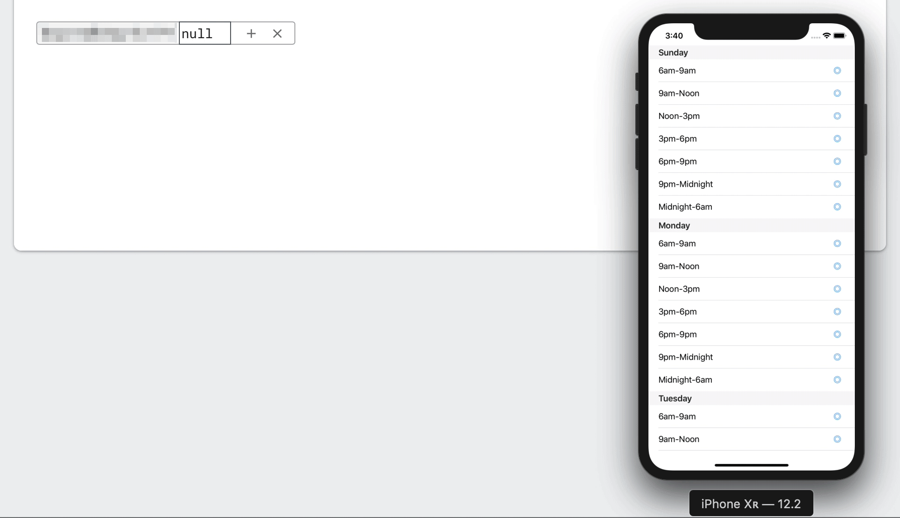

##  Sample Data Model for Table View

See https://stackoverflow.com/a/55989901/1271826

Developed in Swift on Xcode 10.2.1 and Swift 5. But the basic ideas are equally applicable for different versions of Swift.

Note, I've excluded my personal `GoogleService-Info.plist` from this project. Create your own project and app on the Firebase console, download the `GoogleService-Info.plist` and add it to this project. Also, I'm not using user authentication, but you obviously should so that you can lock down your database.

Obviously, now that this uses Cocoapods, open the `DogWalking.xcworkspace`, not the `DogWalking.xcodeproj`. 

But here it is in operation, running on simulator with Firebase console in the background, so you can see what's going on in the database.

### License

Copyright &copy; 2019 Robert Ryan. All rights reserved.

 This work is licensed under a <a rel="license" href="http://creativecommons.org/licenses/by-sa/4.0/">Creative Commons Attribution-ShareAlike 4.0 International License</a>.

--

5 May 2019
